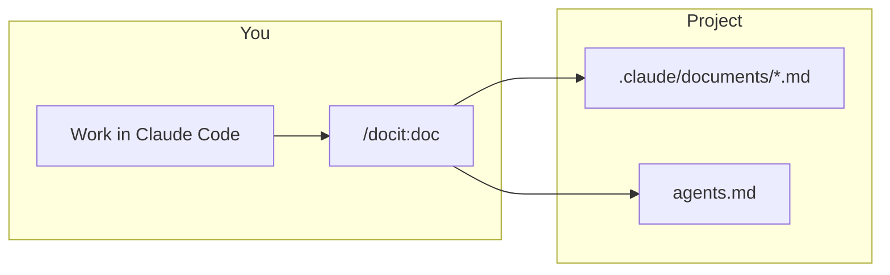
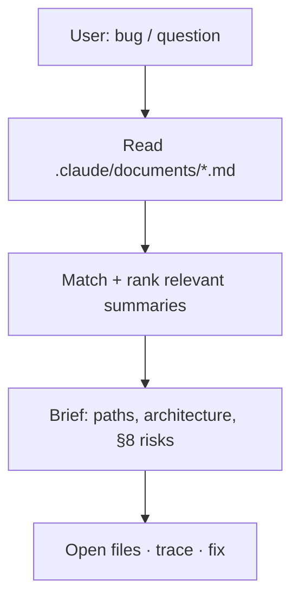

# Claude Docit plugin

Turn **Claude Code** sessions into **`.claude/documents/`** summaries—and **only explicit user rules** into a single **`## Docit`** block in **`agents.md`**. Reuse those docs later with **`/docit:up`** when something breaks.

**Repository:** [github.com/yash0208/claude-docit-plugin](https://github.com/yash0208/claude-docit-plugin)

---

## Commands (short names)

| Command | When to use |
|---------|-------------|
| **`/docit:doc`** | After meaningful work—**save** a 12-section summary; **`agents.md`** only gets **strict instructions the user actually said** (one **`## Docit`** section, bullets appended). |
| **`/docit:up`** | **Later:** you have a bug or question—read past summaries, **find the relevant feature**, then debug using documented paths and architecture. |
| **`/docit:list`** | Quick **index** of all summaries (date + title) before picking one mentally or running **`up`**. |

Everything runs **in the same session**—no separate API. Old **`/docit:docit`** is removed; use **`/docit:doc`**.

---

## Requirements

- [Claude Code](https://claude.com/claude-code) CLI  
- **Anthropic access for Claude Code** — Docit only runs inside Claude Code (plan and/or API billing per [Claude Code docs](https://docs.anthropic.com/en/docs/claude-code)). No separate Docit fee.

## Install

### From Claude Code marketplace (recommended)

Docit is listed in the **yash-docit** marketplace ([source repo](https://github.com/yash0208/claude-docit-plugin)). **Install:**

```
/plugin install docit@yash-docit
```

| Part | Meaning |
|------|--------|
| **`docit`** | Plugin **`name`** in `.claude-plugin/marketplace.json` and `.claude-plugin/plugin.json` |
| **`yash-docit`** | Marketplace **`name`** in `.claude-plugin/marketplace.json` |

**First time on this machine?** You only **register** the marketplace **once per device** (per Claude Code environment). If install fails because the catalog isn’t there yet, add it, then install again:

```
/plugin marketplace add yash0208/claude-docit-plugin
```

Use `owner/repo` if you use a fork. After the repo updates, refresh the catalog: **`/plugin marketplace update`**.

Slash-command wording can vary by Claude Code version; use **`/plugin`** in the app if needed. Details: [plugin marketplaces](https://docs.anthropic.com/en/docs/claude-code/plugin-marketplaces).

### From source (`git` + `--plugin-dir`)

#### Clone the repo

```bash
git clone https://github.com/yash0208/claude-docit-plugin.git
cd claude-docit-plugin
```

#### Option A — Point Claude at the clone (no copy)

```bash
claude --plugin-dir "$(pwd)"
```

Use the same `--plugin-dir` with the absolute path to your clone whenever you start Claude Code.

#### Option B — Copy to `~/.local/share`

```bash
chmod +x install.sh
./install.sh
```

Then start Claude with the path the script prints, e.g.:

```bash
claude --plugin-dir "$HOME/.local/share/claude-docit-plugin"
```

On macOS/Linux, if `XDG_DATA_HOME` is set, the install target is `$XDG_DATA_HOME/claude-docit-plugin`.

## Usage

1. Start Claude Code with the plugin available (marketplace install above, or `--plugin-dir` from **From source**).
2. Run **`/docit:doc`**, **`/docit:up`**, or **`/docit:list`** as needed (see table above).

**Writes / updates (for `doc` only):**

- **`.claude/documents/<Document Title>.md`** — full summary (frontmatter: `date`, `source: claude-code-docit`, `generatedAt`)
- **`agents.md`** — **only if** the user gave explicit constraints this session: append dated bullets under a **single** heading **`## Docit`** (never a new dated heading per run). If there were no such instructions, Docit leaves `agents.md` unchanged for this step.

Docit does **not** use `.cursor/` or `.mdc` files.

---

## What each flow does

### `/docit:doc` — document the session

Fixed **12-section** template, save under **`.claude/documents/`**; **section 11** syncs to **`agents.md`** only for **explicit user rules**, under one **`## Docit`** block.



### `/docit:up` — pick up from old docs

You **describe the issue** (e.g. “login fails after the JWT change”). The agent **reads** `.claude/documents/*.md`, **matches** the right session(s), pulls **paths + architecture + known failure points**, then **investigates** the codebase using that map.



### `/docit:list` — index only

Lists every summary file with **date** and **title**—fast overview before **`up`**.

---

## Why use it

| Without Docit | With Docit |
|---------------|------------|
| Chat scrolls away | **Named files** under `.claude/documents/` |
| You forget how a feature was built | **`/docit:up`** reconnects the bug to the **original paths and decisions** |
| “Don’t touch X” only in chat | **`agents.md` `## Docit`** keeps **explicit user rules** in one place |

---

## Use cases

| Situation | Command |
|-----------|---------|
| Finished a feature or a big fix | **`/docit:doc`** |
| Something breaks **weeks later** on that feature | **`/docit:up`** + describe the symptom |
| Many session files; unsure which doc applies | **`/docit:list`**, then **`/docit:up`** |
| Quick scan of what was documented | **`/docit:list`** |

---

## Optional: text triggers in `CLAUDE.md`

Merge **`CLAUDE.md.snippet`** into your project’s **`CLAUDE.md`** for shorthands like **`-doc`**, **`-docup`** / **`-docitup`**, **`-doclist`** (same behavior as the slash commands).

## Plugin layout

| Path | Role |
|------|------|
| `.claude-plugin/plugin.json` | Plugin manifest |
| `.claude-plugin/marketplace.json` | Catalog for Claude Code **`/plugin marketplace add`** |
| `commands/doc.md` | **`/docit:doc`** — full write spec |
| `commands/up.md` | **`/docit:up`** — read summaries + debug |
| `commands/list.md` | **`/docit:list`** — index |
| `prompts/DOCIT_SESSION.md` | Same 12-section spec as `doc` (reference) |
| `prompts/DOCIT_UP.md` | Short reference for `up` |

## Reload after edits

```
/reload-plugins
```

## Forks and publishing

- **Fork:** run **`/plugin marketplace add owner/repo`** for your fork. Install stays **`/plugin install docit@yash-docit`** unless you change the marketplace **`name`** in `.claude-plugin/marketplace.json` (then use `docit@<your-marketplace-name>`).
- **Anthropic’s official marketplace:** separate process from this GitHub catalog — see [plugin marketplaces](https://docs.anthropic.com/en/docs/claude-code/plugin-marketplaces).
