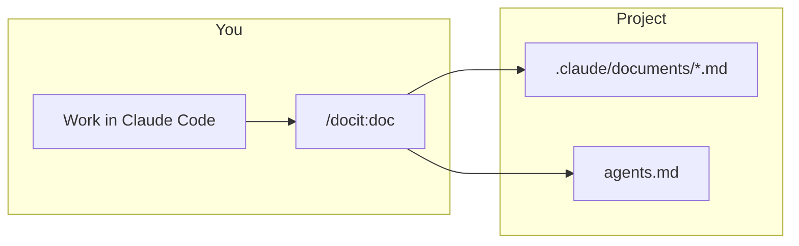
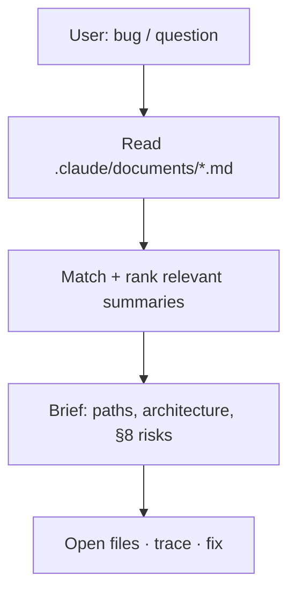

# Claude Docit plugin

Turn **Claude Code** sessions into **`.claude/documents/`** summaries and **`agents.md`** guidance—and **reuse those docs later** when something breaks or you need context.

**Repository:** [github.com/yash0208/claude-docit-plugin](https://github.com/yash0208/claude-docit-plugin)

---

## Commands (short names)

| Command | When to use |
|---------|-------------|
| **`/docit:doc`** | After meaningful work—**save** this session as a 12-section summary + append guidance to `agents.md`. |
| **`/docit:up`** | **Later:** you have a bug or question—read past summaries, **find the relevant feature**, then debug using documented paths and architecture. |
| **`/docit:list`** | Quick **index** of all summaries (date + title) before picking one mentally or running **`up`**. |

Everything runs **in the same session**—no separate API. Old **`/docit:docit`** is removed; use **`/docit:doc`**.

---

## Requirements

- [Claude Code](https://claude.com/claude-code) CLI

## Install

### Get the plugin

```bash
git clone https://github.com/yash0208/claude-docit-plugin.git
cd claude-docit-plugin
```

### Option A — Point Claude at the clone (no copy)

```bash
claude --plugin-dir "$(pwd)"
```

Use the same `--plugin-dir` with the absolute path to your clone whenever you start Claude Code.

### Option B — Copy to `~/.local/share` (recommended)

```bash
chmod +x install.sh
./install.sh
```

Then start Claude with the path the script prints, e.g.:

```bash
claude --plugin-dir "$HOME/.local/share/claude-docit-plugin"
```

On macOS/Linux, if `XDG_DATA_HOME` is set, the install target is `$XDG_DATA_HOME/claude-docit-plugin`.

## Usage

1. Start Claude Code with `--plugin-dir` pointing at this plugin (see above).
2. Run **`/docit:doc`**, **`/docit:up`**, or **`/docit:list`** as needed (see table above).

**Writes / updates (for `doc` only):**

- **`.claude/documents/<Document Title>.md`** — full summary (frontmatter: `date`, `source: claude-code-docit`, `generatedAt`)
- **`agents.md`** — section 11 appended as a dated `## Docit — …` block

Docit does **not** use `.cursor/` or `.mdc` files.

---

## What each flow does

### `/docit:doc` — document the session

Same as before: fixed **12-section** template, save under **`.claude/documents/`**, merge **section 11** into **`agents.md`**.



### `/docit:up` — pick up from old docs

You **describe the issue** (e.g. “login fails after the JWT change”). The agent **reads** `.claude/documents/*.md`, **matches** the right session(s), pulls **paths + architecture + known failure points**, then **investigates** the codebase using that map.



### `/docit:list` — index only

Lists every summary file with **date** and **title**—fast overview before **`up`**.

---

## Why use it

| Without Docit | With Docit |
|---------------|------------|
| Chat scrolls away | **Named files** under `.claude/documents/` |
| You forget how a feature was built | **`/docit:up`** reconnects the bug to the **original paths and decisions** |
| Conventions only in chat | **`agents.md`** carries forward **section 11** guidance |

---

## Use cases

| Situation | Command |
|-----------|---------|
| Finished a feature or a big fix | **`/docit:doc`** |
| Something breaks **weeks later** on that feature | **`/docit:up`** + describe the symptom |
| Many session files; unsure which doc applies | **`/docit:list`**, then **`/docit:up`** |
| Quick scan of what was documented | **`/docit:list`** |

---

## Optional: text triggers in `CLAUDE.md`

Merge **`CLAUDE.md.snippet`** into your project’s **`CLAUDE.md`** for shorthands like **`-doc`**, **`-docup`** / **`-docitup`**, **`-doclist`** (same behavior as the slash commands).

## Plugin layout

| Path | Role |
|------|------|
| `.claude-plugin/plugin.json` | Plugin manifest |
| `.claude-plugin/marketplace.json` | Catalog for Claude Code **`/plugin marketplace add`** |
| `commands/doc.md` | **`/docit:doc`** — full write spec |
| `commands/up.md` | **`/docit:up`** — read summaries + debug |
| `commands/list.md` | **`/docit:list`** — index |
| `prompts/DOCIT_SESSION.md` | Same 12-section spec as `doc` (reference) |
| `prompts/DOCIT_UP.md` | Short reference for `up` |

## Reload after edits

```
/reload-plugins
```

## Install via Claude Code marketplace (this repo)

This repo includes **`.claude-plugin/marketplace.json`**, so others can add it as a **custom marketplace** (not the same as Anthropic’s built-in catalog—you host the GitHub repo; users point Claude Code at it).

1. **Push** this repo to GitHub (e.g. [yash0208/claude-docit-plugin](https://github.com/yash0208/claude-docit-plugin)).
2. In **Claude Code**, register the marketplace (exact command may vary by version; see [Create and distribute a plugin marketplace](https://docs.anthropic.com/en/docs/claude-code/plugin-marketplaces)):
   - Typically: **`/plugin marketplace add yash0208/claude-docit-plugin`** (or your `owner/repo`).
3. **Install the plugin** from that marketplace:
   - **`/plugin install docit@yash-docit`**  
   - Here **`yash-docit`** is the marketplace **`name`** in `marketplace.json`; **`docit`** is the plugin entry’s **`name`** (must match `.claude-plugin/plugin.json`).
4. Refresh the catalog later with **`/plugin marketplace update`** when you change the repo.

**Publish to Anthropic’s official marketplace:** that is a **separate** process (submission / review by Anthropic). The file above is for **your own** GitHub-hosted marketplace as described in the docs.

## Distribute your own fork

Clone this repo (or your fork) and follow **Install** above, or use the marketplace steps above with your fork’s `owner/repo`.
