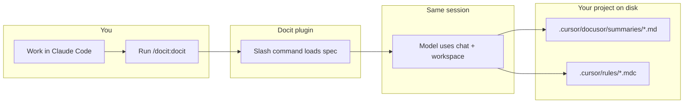
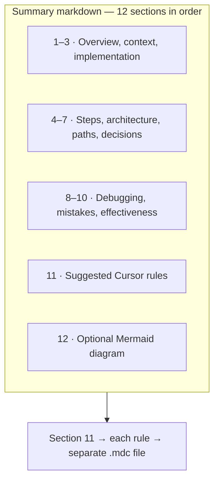

# Claude Docit plugin

Turn a **Claude Code** chat into a **developer learning artifact**: one structured markdown file in your repo (plus optional Cursor rule files). Everything is generated **in the same session** as your work—no separate API or export step.

**Repository:** [github.com/yash0208/claude-docit-plugin](https://github.com/yash0208/claude-docit-plugin)

---

## What it does

After you have worked with Claude Code in a project, run **`/docit:docit`**. The assistant follows a fixed **12-section template** and writes:

1. **A session summary** — `.cursor/docusor/summaries/<Document Title>.md`  
   A durable write-up: what you asked for, what changed, how it was done, pitfalls, and suggested follow-up rules.

2. **Optional rule files** — from **section 11** of that summary, each suggested rule becomes its own **`.cursor/rules/<slug>.mdc`** file so Cursor can reuse those conventions later.

The source of truth is **this conversation’s history** (as far as the model’s context reaches). Very long sessions may be summarized with a note if the context does not cover the full thread.





---

## Why use it

| Without Docit | With Docit |
|---------------|------------|
| Chat scrolls away and context is lost | You keep a **named document** tied to the repo |
| Tribal knowledge stays in the thread | **Onboarding and debugging** notes live next to the code |
| Conventions are only in chat | Section **11** can become **reusable `.mdc` rules** |

---

## Use cases

| Situation | What you get |
|-----------|----------------|
| **Finish a feature or fix** | A dated summary of scope, files touched, and decisions—easy to link from a PR or ticket. |
| **Pair programming or review** | A structured write-up for teammates who were not in the chat: what changed and why. |
| **Debugging sprees** | Sections on failure points, mistakes, and fixes become a trail you can search next time the issue appears. |
| **Refactors and migrations** | Architecture and project-structure sections capture before/after and risky areas. |
| **Team or personal playbook** | Summaries under `.cursor/docusor/summaries/` build a **local knowledge base** in the repo. |
| **Codify conventions** | Section 11 becomes **`.cursor/rules/*.mdc`** so Cursor (and future sessions) follow the same patterns. |

---

## Requirements

- [Claude Code](https://claude.com/claude-code) CLI

## Install

### Get the plugin

```bash
git clone https://github.com/yash0208/claude-docit-plugin.git
cd claude-docit-plugin
```

### Option A — Point Claude at the clone (no copy)

```bash
claude --plugin-dir "$(pwd)"
```

Use the same `--plugin-dir` with the absolute path to your clone whenever you start Claude Code.

### Option B — Copy to `~/.local/share` (recommended)

```bash
chmod +x install.sh
./install.sh
```

Then start Claude with the path the script prints, e.g.:

```bash
claude --plugin-dir "$HOME/.local/share/claude-docit-plugin"
```

On macOS/Linux, if `XDG_DATA_HOME` is set, the install target is `$XDG_DATA_HOME/claude-docit-plugin`.

## Usage

1. Start Claude Code with `--plugin-dir` pointing at this plugin (see above).
2. In the chat, run: **`/docit:docit`**

The agent writes files under the **project root** you opened in Claude Code:

- `.cursor/docusor/summaries/<Document Title>.md` — full 12-section summary (with YAML frontmatter: `date`, `source: claude-code-docit`, `generatedAt`)
- `.cursor/rules/<slug>.mdc` — one file per rule from section 11 (if any)

## Optional: `-docit` in your project

To treat **`-docit`** like Docit without relying on the slash command name alone, add the contents of `CLAUDE.md.snippet` to your project’s **`CLAUDE.md`** (or merge into your existing file).

## Plugin layout

| Path | Role |
|------|------|
| `.claude-plugin/plugin.json` | Plugin manifest |
| `commands/docit.md` | Slash command `/docit:docit` and full output spec |
| `prompts/DOCIT_SESSION.md` | Same spec as the command (reference copy) |

## Reload after edits

If you change plugin files:

```
/reload-plugins
```

## Distribute your own fork

Others can clone this repo (or your fork) and follow **Install** above. To publish a [plugin marketplace](https://docs.anthropic.com/en/docs/claude-code/plugin-marketplaces) catalog, add a `.claude-plugin/marketplace.json` in a repo that lists this plugin’s source.
