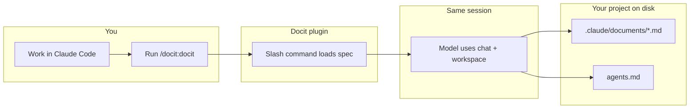
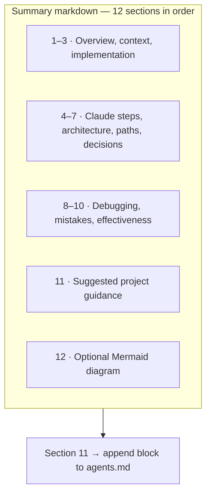

# Claude Docit plugin

Turn a **Claude Code** chat into a **developer learning artifact** under **`.claude/documents/`**, and fold recurring guidance into project-root **`agents.md`** for future sessions. Everything runs **in the same session** as your work—no separate API or export step.

**Repository:** [github.com/yash0208/claude-docit-plugin](https://github.com/yash0208/claude-docit-plugin)

---

## Requirements

- [Claude Code](https://claude.com/claude-code) CLI

## Install

### Get the plugin

```bash
git clone https://github.com/yash0208/claude-docit-plugin.git
cd claude-docit-plugin
```

### Option A — Point Claude at the clone (no copy)

```bash
claude --plugin-dir "$(pwd)"
```

Use the same `--plugin-dir` with the absolute path to your clone whenever you start Claude Code.

### Option B — Copy to `~/.local/share` (recommended)

```bash
chmod +x install.sh
./install.sh
```

Then start Claude with the path the script prints, e.g.:

```bash
claude --plugin-dir "$HOME/.local/share/claude-docit-plugin"
```

On macOS/Linux, if `XDG_DATA_HOME` is set, the install target is `$XDG_DATA_HOME/claude-docit-plugin`.

## Usage

1. Start Claude Code with `--plugin-dir` pointing at this plugin (see above).
2. In the chat, run: **`/docit:docit`**

The agent writes or updates under the **project root** you opened in Claude Code:

- **`.claude/documents/<Document Title>.md`** — full 12-section summary (YAML frontmatter: `date`, `source: claude-code-docit`, `generatedAt`)
- **`agents.md`** — section 11 is **appended** as a dated `## Docit — …` block so Claude Code can reuse that guidance later (file is created if missing)

Docit does **not** write `.cursor/` paths or `.mdc` files.

---

## What it does

After you have worked with Claude Code in a project, run **`/docit:docit`**. The assistant follows a fixed **12-section template** and:

1. Saves a **session summary** to **`.claude/documents/<Document Title>.md`** (Docit’s Claude-specific document folder).
2. Takes **section 11 (Suggested Project Guidance)** and **appends** it to **`agents.md`** at the repo root with a clear heading and bullet list.

The source of truth is **this conversation’s history** (as far as the model’s context reaches). Very long sessions may be summarized with a note if the context does not cover the full thread.





---

## Why use it

| Without Docit | With Docit |
|---------------|------------|
| Chat scrolls away and context is lost | You keep a **named document** under `.claude/documents/` |
| Tribal knowledge stays in the thread | **Onboarding and debugging** notes live in-repo for Claude workflows |
| Conventions are only in chat | Section **11** accumulates in **`agents.md`** for the next session |

---

## Use cases

| Situation | What you get |
|-----------|----------------|
| **Finish a feature or fix** | A dated summary under `.claude/documents/`—easy to link from a PR or ticket. |
| **Pair programming or review** | A structured write-up for people who were not in the chat. |
| **Debugging sprees** | Failure points and fixes become a trail you can search later. |
| **Refactors and migrations** | Architecture and path sections capture before/after and risky areas. |
| **Team or personal playbook** | `.claude/documents/` builds a **session knowledge base** next to your code. |
| **Codify conventions for Claude** | **`agents.md`** collects Docit guidance so future Claude Code runs stay aligned. |

---

## Optional: `-docit` in your project

To treat **`-docit`** like Docit without relying on the slash command alone, add the contents of `CLAUDE.md.snippet` to your project’s **`CLAUDE.md`** (or merge into your existing file).

## Plugin layout

| Path | Role |
|------|------|
| `.claude-plugin/plugin.json` | Plugin manifest |
| `commands/docit.md` | Slash command `/docit:docit` and full output spec |
| `prompts/DOCIT_SESSION.md` | Same spec as the command (reference copy) |

## Reload after edits

If you change plugin files:

```
/reload-plugins
```

## Distribute your own fork

Others can clone this repo (or your fork) and follow **Install** above. To publish a [plugin marketplace](https://docs.anthropic.com/en/docs/claude-code/plugin-marketplaces) catalog, add a `.claude-plugin/marketplace.json` in a repo that lists this plugin’s source.
